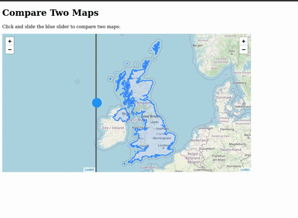

# ADM_Comparison

The purpose of this project is to create a tool that allows a user to compare
various spatial data side by side. Particularly spatial data from the geoboundaries.org website and other spatial data open source boundaries.  
In the preview below, the geoboundaries spatial data is the one on the right and is being compared against spatial data from another site

